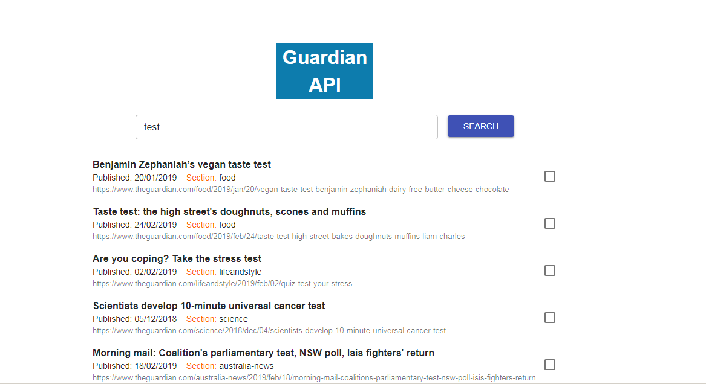

<p align="center">
    <h3 align="center">Guardian content API (React-based single page app)<br></h3>
</p>

*Preview: https://yinfei-guardian-api.firebaseapp.com/

## Screenshots


*Project built with API from https://open-platform.theguardian.com/

### What were using

* Create-react-app
* Material-UI

### Features

* Implementation of a text field which takes user input to perform a search result from the Guardian’s content API. 
* The search result will display a set of items with title,link,published date, which grouped by section.
* Each item has a checkbox that allows it to be pinned, pinned items appear below the search results, and stay on screen.

### To run localhost

* Clone the project 

* Need to compile before running and npm install to install the dependencies

* Install the dependencies by:

```
npm install
```

* Run development server by:

```
npm run server
```

Open the web browser to `http://localhost:3000/`

* It takes some time for create-react-app to compile the project

### Questions from task requirements:

* Not mentioned in task requirements and needed to specific further:

* What is the time that users want to call api? When users are typing or after pressing the search button? 
 
* We could search by key words now, do we need search by "tag", "page","published date","section", 
do we need add those functions in just "one" text field as the task specified?

* The api will return errors for searching some key words if you press "last" button to request the last page.

* The error message from the api is simple, I try to catch "error.response","error.request","error.config","error.message",
nothing I could get except "error.message", which includes information without response code.

* As task required, pinned items appear with the search results, what if the search result is null by some key words or
error page? Should the pinned items still appear on the page?


